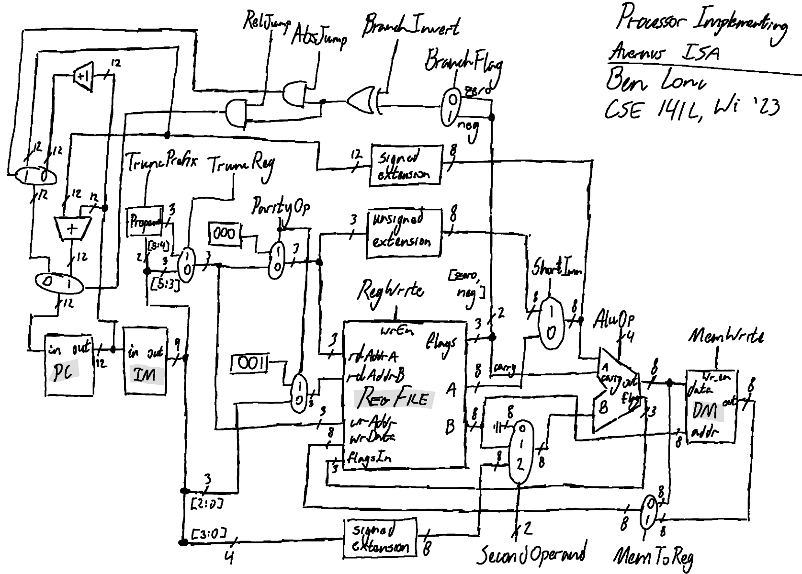

# CSE141L
The modules used in my processor, the test benches for each program, the code for each program, and the assembler for this project are defined in this repo. 

## Performance  
The processor is able to run all three programs correctly. The programs were each tested with the random seed 0 in addition to five different random seeds and worked correctly in each instance. 

## Running the Code 
To run the code, open the project file `CSE141L.mpf` in ModelSim. Compile all source files and start a simulation with the desired test bench (`prog1_tb.sv`, `prog2_tb.sv`, or `prog3_tb.sv`) as the top-level file. The test bench will load the appropriate machine code into instruction memory. Once the simulation is open, click the **Run All** button. The results will be shown in the terminal at the bottom of the window. 

## The Hardware
The processor's components are defined in `alu.sv`, `control.sv`, `dataMem.sv`, `instrROM.sv`, `PC.sv`, `regFile.sv`, and `topLevel.sv`. More information about the architecture is listed on [this milestone document](https://docs.google.com/document/d/1Kbe5wKyfhG0N22peS8esruK5HJYYgxWKgxNMWTjQlO4/edit?usp=sharing).

The following is a diagram of the processor's datapath: 

## The Software 
Programs 1, 2, and 3 are written in Avernus assembly and are shown in detail on [this spreadsheet](https://docs.google.com/spreadsheets/d/1UvVRZq3m4nf3-hq-Jh5bOOxrk3HVLdq0xjRzOh0w4Xs/edit?usp=sharing). This is the master document for these programs as it shows the state of the register file after every instruction and leaves space to account for the expansion of macros. 

My implementation of Program 2 writes the two error indicator bits and the decoded and corrected 11-bit message to memory. 

The programs are written in the assembly language defined in [this guide](https://docs.google.com/document/d/15hNEZVMPxoKqP5pwmp56o1mdrUxBQB_bsx6f8pswB2o/edit?usp=sharing) and converted to machine code by the assembler included in this project. The assembly code programs are specified in `assemblyCode1.txt`, `assemblyCode2.txt`, and `assemblyCode3.txt`. These files are converted to `machineCode1.txt`, `machineCode2.txt`, and `machineCode3.txt`, respectively. Each of these files is read by its respective test bench when it is run in a ModelSim simulation. 

## Using the Assembler 
The `assembler` directory contains the Haskell source for the assembler. The `compileAssembler.sh` script is built to be run on Ubuntu Linux. It builds the assembler from source (assuming the Haskell stack is installed) and automatically copies the binary to this repo's root directory. This binary is called `Assembler`.  